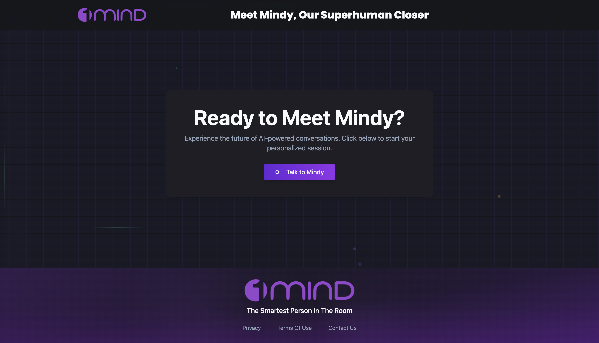
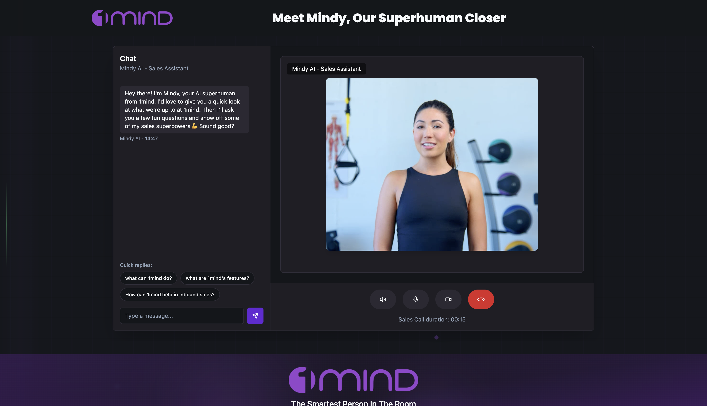

# 1mind Clone - Production Build

This is the production build of 1mind Clone, a sales superhuman with AI avatar integration.

## 🚀 Live Demo

View the live project at: **https://hkedia321.github.io/1mind_clone/**

## 📁 About This Folder

This `dist` folder contains the optimized production build of the application, ready for deployment. All assets are minified and optimized for best performance.

## 🛠 Technologies Used

- **React** - Frontend library for building user interfaces
- **TypeScript** - Type-safe JavaScript for better development experience
- **Node.js** - Runtime environment for development tools
- **HeyGen** - AI avatar streaming integration
- **Vite** - Fast build tool and development server
- **Tailwind CSS** - Utility-first CSS framework

## 📸 Screenshots

### Homepage

### Chat Interface

## 🔧 Deployment

This build is optimized and ready for deployment on any static hosting service like:

- GitHub Pages
- Netlify
- Vercel
- AWS S3
- Firebase Hosting

## 📋 Contents

- `index.html` - Main HTML file
- `assets/` - Compiled CSS, JavaScript, and other static assets
- `uploads/` - User uploaded content directory
- `robots.txt` - Search engine crawling instructions
- `sitemap.xml` - Site structure for search engines

## 👨‍💻 Author

**@hkedia321**

---

_This is the production build. For development and source code, please refer to the main project directory._
